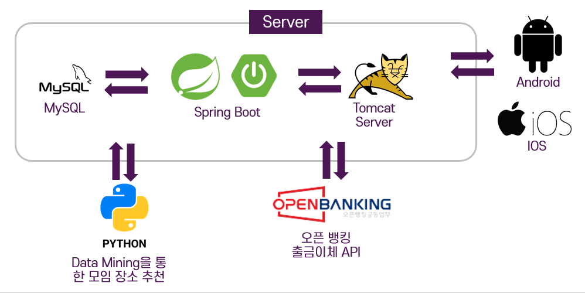
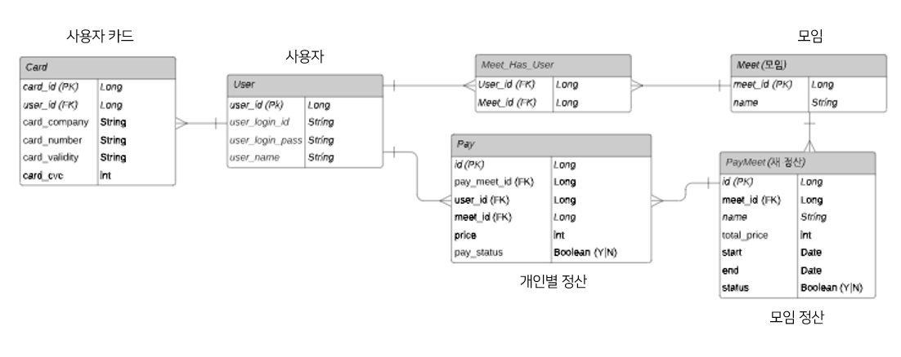

# FinPay
모임원 카드 등록을 기반으로 생성된 가상 결제 수단과 이를 통한 자동 정산 서비스

2021.07 ~ 2021.08.23

___
- ### 목차
    - [**프로젝트 개요**](#outline)
    - [**요구사항**](#requirements)
    - [**프로젝트 구조**](#structure)

---
- ### 프로젝트 개요
  - Pre - 인턴십 2기 해커톤 (지급 결제 / 간편 송금) 7조 출품작 입니다.
  - 현재 존재하는 모임비 정산 서비스의 문제점을 도출하고 해당 문제점을 해결하는 서비스를 기획하였습니다.
  - 더 나아가, 모임 활동에 도움이 되는 부가기능을 탑재하여 사용자의 편의성을 증진하였습니다.

---
- ### 요구사항
  - 모임마다 가상 결제 수단을 통함 자동 정산 기능
      - 모임에 소속된 모임원은 사전에 자신의 카드를 서비스에 등록한다.
      - 모임원은 모임 가상 결제 수단을 통해 결제하기 전, 모임원에게 정산 세부사항과 함께 정산 승인 요청을 보냅니다.
      - 모든 모임원이 승인시, 모임 가상 결제 수단을 통해 결제가 가능합니다.
      - 결제 시, 초기에 등록한 각 모임원의 카드 로부터 자신의 몫에 맞는 돈이 수합되어 모임비가 결제됩니다.
  - 모임장부 서비스
      - 모임마다 결제된 결제 내역을 저장하여, 모임원은 언제든지 자신의 모임 창 으로부터, 과거 정산 세부 사항을 확인 가능합니다.
  - 모임 장소 추천 서비스
      - 사용자에게 마이데이터를 활용한 사용자 결제 내역 기반으로 모임의 목적에 맞는 장소를 추천해줍니다.

___
- ### 프로젝트 구조  
  - 
  - 
  - REST API
    - 모임 생성
      - |항목|Key|Value|
        |------|---|---|
        |url||/meet/save|
        |method||POST|
        |Body|||
        ||userList|(List<'String>)userList|
        ||meet_name|(String)meet_name|
        |Result(JSON)|||
        |array of|||
        ||id|(Long)meet_id|
        ||name|(String)meet_name|
    - 새로운 정산 생성
      - |항목|Key|Value|
        |------|---|---|
        |url||/paymeet/save|
        |method||POST|
        |Body|||
        ||userList|(List<'String>)userList|
        ||PayMeetInfo|(List<'String>)payMeetInfo|
        |Result(JSON)|||
        |array of|||
        ||name|(String)name|
        ||totalPrice|(int)totalPrice|
        ||status|(boolean)status|